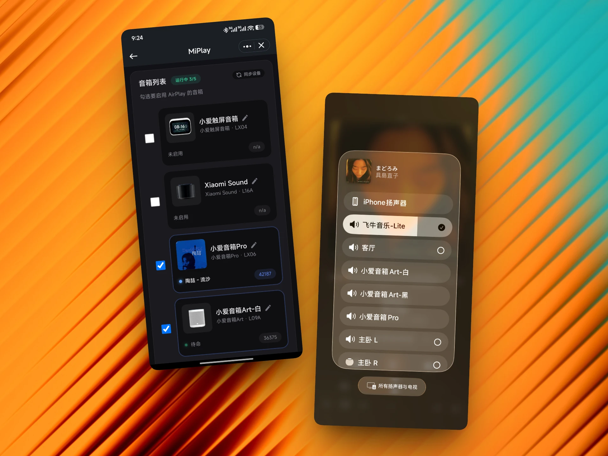
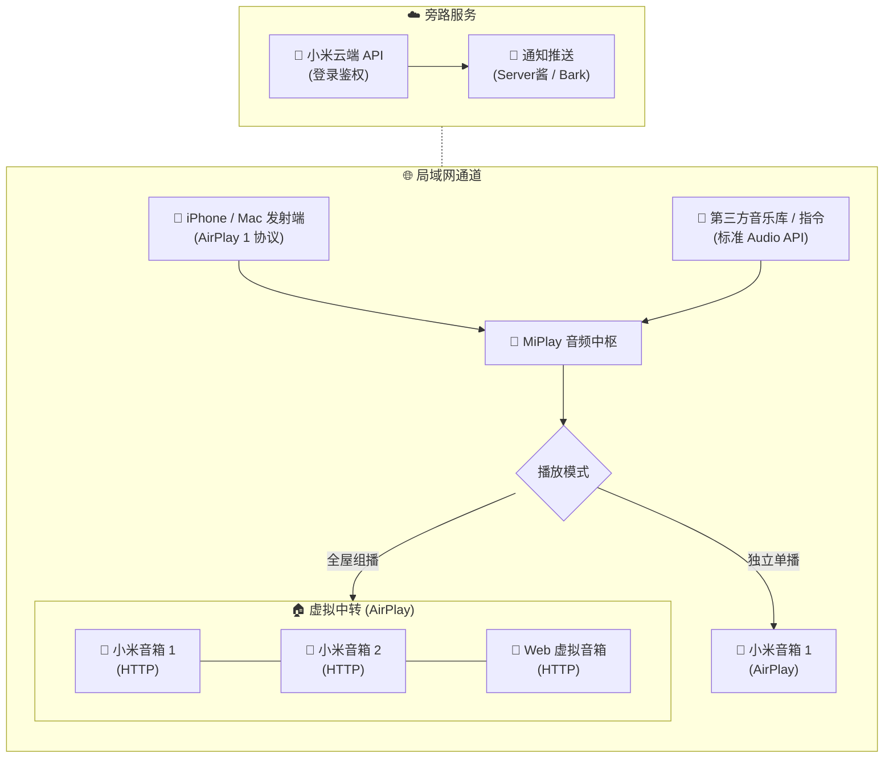
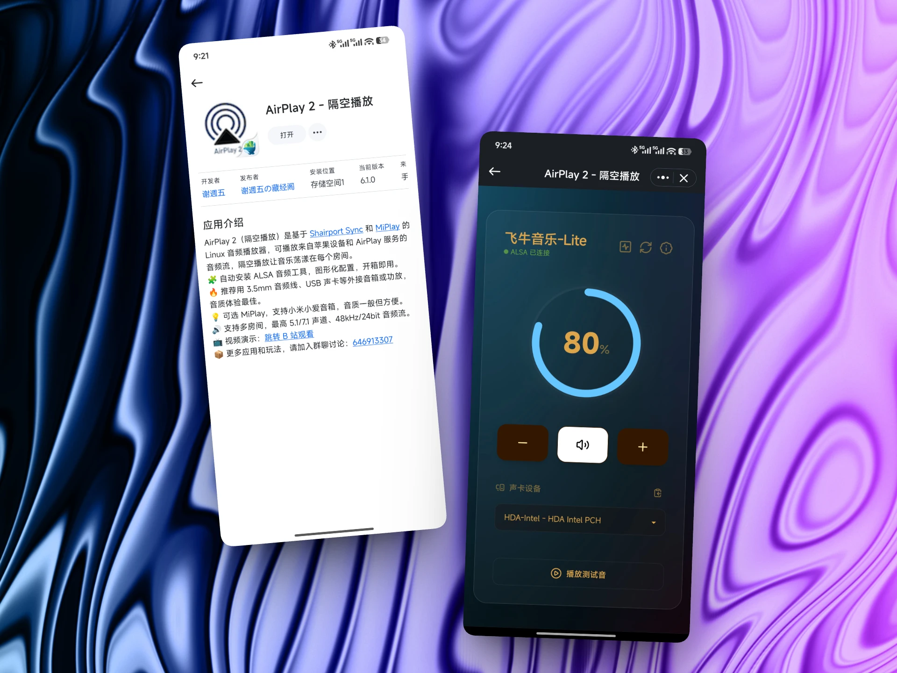

# MiPlay 

MiPlay（隔空妙播）是专为苹果用户和小米音箱打造的**局域网音频中枢**，它可以把小米音箱桥接为 AirPlay 1 设备、首发🔥`MiPlay 全屋组播`，另有 `Web 虚拟音箱`、`开放音频 API`、`兼容 OwnTone` 等开放式玩法。
> 本项目参考并整合了 [MiAir](https://github.com/KiriChen-Wind/MiAir)、[miair-next](https://github.com/deerwan/miair-next)、[miservice-fork](https://pypi.org/project/miservice-fork/)、[XiaoMusic](https://github.com/hanxi/xiaomusic) 等项目的思路与部分实现，面向自用场景进行了大量重构。




## ✨ 功能特色

- 🚀 **桥接 AirPlay 1**：局域网直连播放，低延迟无损直通
- 🔥 **全屋组播 Beta**：苹果系统级兼容`小米妙播·全屋播放`
  - 基于 AirPlay 1，建议 5G WiFi 音箱）
- 🌐 **Web 虚拟音箱**：打开网页变身虚拟音箱，全屋组播同步发声
- 🔌 **开放音频 API**：标准的流媒体接口，轻松对接音乐库
- 🔥 **接入 OwnTone**：可跨协议实现`多房间播放`（OwnTone 支持 AirPlay 1&2、Chromecast、DLNA 等）
- 📦 **双架构通用**：支持 x86、arm64 架构的 PC、Mac、Linux 设备

> MiPlay 可以实现小米无线音箱 ➡️ AirPlay 1，虽然很便利，但普遍音质一般。若想要更好的音质表现，推荐传统有线音箱 ➡️ AirPlay 1&2（🔍 Shairport-Sync）

### 📊 音频方案与协议对比

| 对比维度 | MiPlay | AirPlay 1| AirPlay 2 | DLNA | 小米妙播 |
| :--- | :--- | :--- | :--- | :--- | :--- |
| **系统级音频投射** | ✅ 全家桶 | ✅ 全家桶 | ✅ 全家桶 | ❌ 部分 App |  ✅ 全家桶 |
| **多房间同步播放** | ✅ 组播 Beta | ☑️ 仅限 iTunes | ✅ 支持 | ❌ 不支持 | ✅ 支持 |
| **音频通信链路** | ☑️ 同步串流 | ☑️ 同步串流 | ✅ 独立协同 | ☑️ 分离遥控 | ✅ 独立协同 |
| **小米音箱兼容性** | ✅ 全系音箱 | ☑️ Sound 系列  | ☑️ Sound 系列 | ☑️ 部分音箱 | ☑️ 部分音箱 |
| **OwnTone 兼容性** | ✅ 支持 | ✅ 支持  | ✅ 支持| ☑️ 部分音箱 | ❌ 不支持 |
| **硬件加密门槛** |  ✅ 无门槛 | ☑️ 苹果授权 | ☑️ 苹果授权 | ✅ 无门槛 | 🔒 小米独占 |

⚠️ 本项目主要是完善苹果用户的小米音箱 ✖️ AirPlay 体验，暂不考虑 DLNA 功能。
- DLNA 是一个古早的音频协议，虽然新老设备都能用，但整体体验不太好、稳定性欠佳
- 小米小爱音箱自带 DLNA 功能不完整，第三方 DLNA 需额外适配，体验依然不完美
- 如果需要第三方 DLNA 功能，推荐使用 MiAir、miair-next 等项目

## 🔄 业务工作流程



### 🔐 小米账号鉴权说明：
1. **登录方式区别？**
  - **米家 App 扫码登录 (推荐)**：  
    官方渠道获取长效凭证 `passToken`，支持长期无感自动续期。
  - **手动 Cookie 登录 (备用)**：  
    理论上与扫码登录效果相同，保留手动填写方式，作为后备登录方案。
2. **不支持账号密码登录？**   
此方式容易触发小米安全风控限制（如验证码拦截、异地设备封禁），导致登录成功率极低，故不提供。
3. **自动续期原理**   
基于系统存储的 `passToken`（保存于 `conf/config.json`），后台会自动静默换取小米音箱 API 所需的临时 `serviceToken` 令牌，无需手动干预。
4. **安全风险提示**  
⚠️ 小米的 `passToken` 请勿公开泄露，本项目纯内网个人使用，Web 控制台不设置密码访问限制。如需外网调试，推荐使用 `Tailscale` 或 `Zerotier` 更安全。

### 🎵 音频处理与格式支持

* **原生直连格式**：`.mp3`、`.m4a`、`.flac`、`.wav`、`.m3u8`（小米音箱硬件解码，不经过音频中枢，0 转码）；
* **中枢转码扩展**：搭配 **FFmpeg** 中转解码，可兼容更多音频格式，推流至全屋。

### 🔊 音量说明

苹果（分贝）VS 小米音箱（百分比）对照参考表

| 苹果音量 | 滑块位置 | 小米音量 | 说明 |
| :--- | :--- | :--- | :--- |
| **`0.0 dB`** | 100%| **100** | 最大音量 |
| `-5.0 dB` | 约 85% | **83** | |
| `-10.0 dB` | 约 70% | **66** | |
| `-15.0 dB` | 约 50% | **50** | |
| **`-20.0 dB`** | **约 30%** | **33** | 默认安全音量 |
| `-25.0 dB` | 约 15% | **16** | 原版代码音量 |
| **`-30.0 dB`** | 约 1% | **0** | 最小音量 |
| `-144.0 dB` | 0% | **0** | 静音状态 |

## 🚀 部署方式

### 1、Docker Compose（推荐）

```yaml
services:
  miplay:
    #image: docker.1ms.run/juneix/miplay2 # 毫秒镜像加速 
    image: ghcr.io/juneix/miplay2:latest
    container_name: miplay
    network_mode: host
    restart: unless-stopped
    environment:
      WEB_PORT: 8820
    volumes:
      - ./conf:/app/conf
```

### 2、Docker CLI

```bash
docker run -d \
  --name miplay \
  --network host \
  --restart unless-stopped \
  -e WEB_PORT=8820 \
  -v "${PWD}/conf:/app/conf" \
  ghcr.io/juneix/miplay2
  # docker.1ms.run/juneix/miplay2 # 毫秒镜像加速 
```

### 3、飞牛应用

飞牛商店的【AirPlay 2 - 隔空播放】已经整合 MiPlay。



### 4、uv 本地运行

```bash
# 安装 uv 包管理器
curl -LsSf https://astral.sh/uv/install.sh | sh

# 克隆项目并进入目录
git clone https://github.com/juneix/MiPlay2.git
cd MiPlay2

# 1. 本地直接运行
uv run miplay

# 2. (可选) 全局安装为系统 CLI 命令，任何目录直接启动
uv tool install .
miplay
```

## ❤️ 支持项目

- 打赏鼓励：支持我开发更多有趣应用
- 互动群聊：加入 💬 [QQ 群](https://qm.qq.com/q/ZzOD5Qbhce) 可在线催更
- 更多内容：访问 ➡️ [谢週五の藏经阁](https://5nav.eu.org)

<div align="center">
  <table>
    <tr>
      <td align="center">
        <br/>
        <sub>微信</sub>
      </td>
      <td align="center">
        <br/>
        <sub>支付宝</sub>
      </td>
    </tr>
  </table>
</div>
